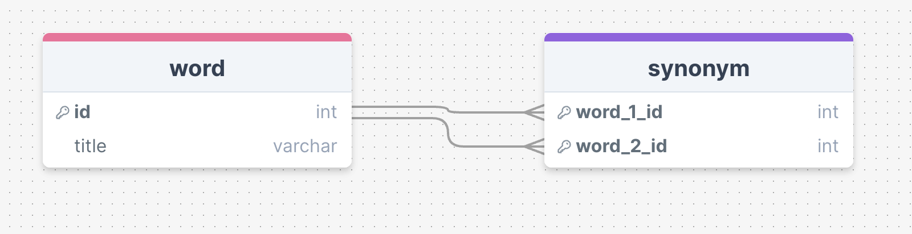

# Words
Create collections of words and their synonyms.
The project is publicly deployed [here](http://188.245.69.243:3000/).

## How To Run Locally
### Prerequisite
* You need to have these technologies installed:
    - docker
    - go version 1.21
    - node js version 20
    - npm

### Follow these steps
1- Words backend uses Postgres for storing words. To run Postgres locally using docker, try to run this command:
```
docker run --name lendo-postgres -p 127.0.0.1:3399:5432 -e POSTGRES_PASSWORD=123 -d postgres
```
2- Run migrations to create tables in Postgres:
```
make migration
```
3- Create the .env file in backend directory exactly like the sample_env.txt file.

4- Run backend and frontend on two separate terminal:
```
make run-backend
make run-front
```

## Assumptions
* Being a synonym is a 2 way relationship, for example, if A is synonym of B, then B is also synonym of A.
* Being a synonym is not a transitive relationship, for example, if A is a synonym of B, and B is a synonym of C, A is not necessarily a synonym of C.
* The task requires to develope two retrieving APIs, Retrieving synonyms for a given word and Retrieving words for a given synonym. After giving so much thought on this, it seems they are doing the same thing, synonyms of a word looks the same as words of a synonym. That's why I only created an API for Retrieving synonyms for a given word.

## Solution and Design
### Backend
* I used Postgres as the database, firstly because the size of data is limited since the size of words are limited (wordnet database has 150k words) and we don't have to worry about scaling database. With that said, sql databases simplicity make them an appealing choice here. An alternative is a graph database like Neo4j, but for this problem, it doesn't worth the hassle in my opinion.
* I defined 2 tables, one for storing words called word, and the other one for storing synonym relationship called synonym.

<div align="center"></div>

* To avoid loops in synonym relationships, I put a simple constraint in synonym table: first word id must always be smaller than the second word id. This way, loop creating is impossible.
* To find all synonyms of a word, we only need to select all rows from synonym table where word_1_id or word_2_id equals the word id.
### Frontend
* I used React JS and the following technologies for building UI:
* Bootstrap: It provides an enough range of pre-styled components and utilities to speed up the development process.
* React Toastify: It is a notification library that allows for easy and customizable toast messages.
* Prop-Types: It is used to document the intended types of properties passed to components, helping to catch bugs and ensure the correct usage of components.
* Eslint: ensures adherence to best practices in React development.